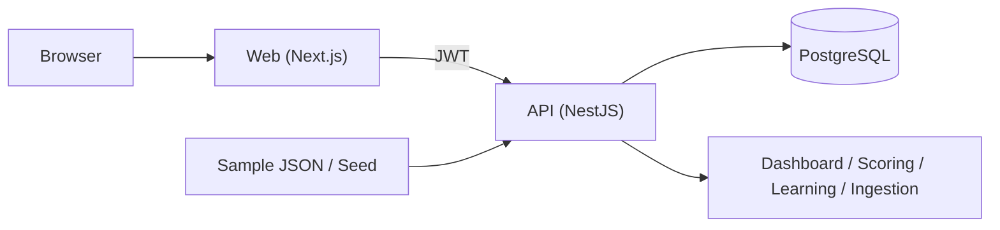
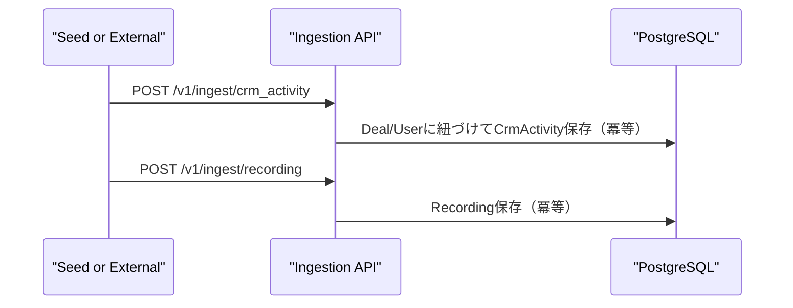
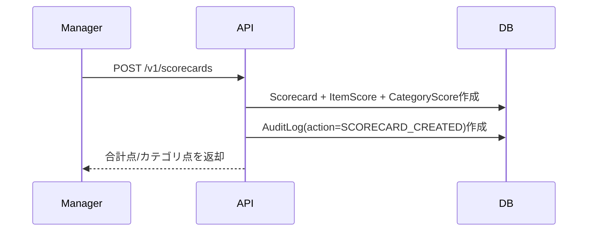
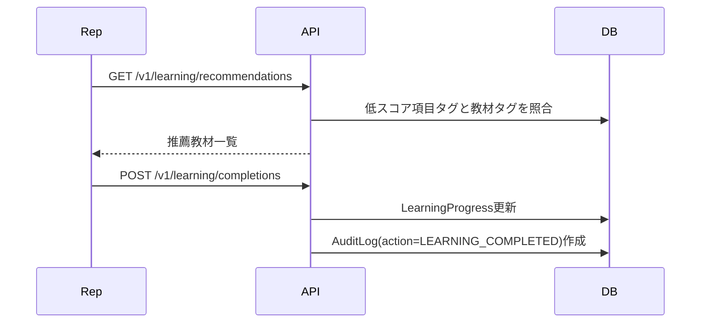
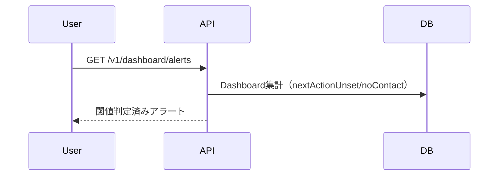

# Sales Enablement MVP

営業の可視化（ダッシュボード）×スコアリング×学習導線を、ローカルで再現できる社内向けMVPです。

## 1. 技術スタック
- Web: Next.js 14 (App Router)
- API: NestJS 10 + Prisma
- DB: PostgreSQL 16
- 認証: メール/パスワード + JWT
- 認可: RBAC（Admin / Manager / Rep）
- 実行基盤: Docker Compose

## 2. アーキテクチャ


## 3. ディレクトリ構成
- `apps/api`: APIサーバー（NestJS / Prisma）
- `apps/web`: Webアプリ（Next.js）
- `apps/api/prisma`: スキーマ、マイグレーション、seed
- `apps/api/samples/ingest`: 取り込みサンプルJSON
- `docker-compose.yml`: ローカル起動定義

## 4. 前提条件
- Docker / Docker Compose が利用可能
- ローカルポート `3000` / `4000` / `5432` が空いている

## 5. 起動手順（READMEだけで再現）
1. コンテナ起動
```bash
docker compose up --build -d
```

2. マイグレーション適用
```bash
docker compose exec api npm run db:migrate
```

3. seed投入（ダミーデータ）
```bash
docker compose exec api npm run seed
```

4. アクセス先
- Web: [http://localhost:3000](http://localhost:3000)
- API: [http://localhost:4000/v1](http://localhost:4000/v1)

## 6. サンプルログイン
- Admin: `admin@local.test / password123`
- Manager: `manager@local.test / password123`
- Rep: `rep@local.test / password123`

## 7. 権限（RBAC）
| 機能 | Admin | Manager | Rep |
| --- | --- | --- | --- |
| 自分のダッシュボード閲覧 | 可 | 可 | 可 |
| チームダッシュボード閲覧 | 全チーム可 | 自チーム可 | 不可 |
| 詰まりアラート取得 (`/dashboard/alerts`) | `teamId` or `repId` 指定で可 | 既定で自チーム可、`repId` 指定可 | 自分のみ可 |
| スコアカード作成 | 不可（MVP方針） | 可（自チーム録画のみ） | 不可 |
| スコアカード閲覧 | 全件可 | 自チーム + 自分が評価したもの | 自分の商談のみ |
| 教材登録 | 可 | 不可 | 不可 |
| 推薦閲覧/完了記録 | 全員可（スコープ制御あり） | 自チームRep対象可 | 自分のみ |
| 監査ログの直接参照 | DB直参照で可（運用者） | DB直参照で可（運用者） | 想定外 |

## 8. テーブル概要（主要）
| テーブル | PK | 主なFK | 主要カラム |
| --- | --- | --- | --- |
| `User` | `id` | `managerId -> User.id` | `email`, `name`, `role` |
| `Team` | `id` | `managerUserId -> User.id` | `name` |
| `TeamMembership` | `id` | `teamId -> Team.id`, `userId -> User.id` | `membershipRole` |
| `Deal` | `id` | `ownerUserId -> User.id`, `teamId -> Team.id` | `title`, `stage`, `nextActionDue`, `amount` |
| `CrmActivity` | `id` | `dealId -> Deal.id`, `actorUserId -> User.id` | `type`, `occurredAt`, `outcome`, `metadata` |
| `Recording` | `id` | `dealId -> Deal.id`, `activityId -> CrmActivity.id` | `mediaUrl`, `transcriptText`, `source`, `externalEventId` |
| `Scorecard` | `id` | `dealId`, `recordingId`, `evaluatedUserId`, `evaluatorUserId` | `totalScore`, `overallComment`, `evaluatedAt` |
| `ScorecardItemScore` | `id` | `scorecardId -> Scorecard.id` | `criterionKey`, `category`, `score`, `comment`, `weakTag` |
| `KnowledgeContent` | `id` | - | `title`, `contentType`, `difficulty`, `estimatedMinutes`, `url` |
| `Recommendation` | `id` | `userId`, `scorecardId`, `contentId` | `reason`, `status`, `generatedAt`, `completedAt` |
| `LearningProgress` | `id` | `userId`, `contentId`, `recommendationId` | `status`, `spentMinutes`, `completedAt` |
| `AuditLog` | `id` | `actorUserId -> User.id` | `action`, `resourceType`, `resourceId`, `beforeJson`, `afterJson` |

## 9. 主要フロー
### 9.1 取り込み（CRM活動/録画）


### 9.2 スコアリング


### 9.3 学習導線


### 9.4 詰まりアラート


## 10. 主要API
### 認証
- `POST /v1/auth/login`
- `GET /v1/auth/me`

### ダッシュボード
- `GET /v1/dashboard/me`
- `GET /v1/dashboard/rep/:id?from=&to=`
- `GET /v1/dashboard/team/:teamId?from=&to=`
- `GET /v1/dashboard/alerts?teamId=&repId=&from=&to=&nextActionUnsetThreshold=&noContactThreshold=`

### 取り込み
- `POST /v1/ingest/crm_activity`
- `POST /v1/ingest/recording`

### スコアカード
- `GET /v1/scorecard-templates`
- `POST /v1/scorecard-templates`（Admin）
- `POST /v1/scorecard-templates/:id/activate`（Admin）
- `GET /v1/scorecards`
- `GET /v1/scorecards/:id`
- `GET /v1/scorecards/recordings/:recordingId/history`
- `POST /v1/scorecards`（Manager）

### 学習
- `GET /v1/learning/recommendations?repId=&threshold=&limit=`
- `POST /v1/learning/completions`
- `GET /v1/learning/team-progress?teamId=`
- `GET /v1/learning/contents`
- `POST /v1/learning/contents`（Admin）

## 11. API利用例
### 11.1 ログイン
```bash
curl -s -X POST http://localhost:4000/v1/auth/login \
  -H "Content-Type: application/json" \
  -d '{"email":"manager@local.test","password":"password123"}'
```

### 11.2 取り込み
```bash
curl -X POST http://localhost:4000/v1/ingest/crm_activity \
  -H "Authorization: Bearer <token>" \
  -H "Content-Type: application/json" \
  -d @apps/api/samples/ingest/crm_activities.json
```

```bash
curl -X POST http://localhost:4000/v1/ingest/recording \
  -H "Authorization: Bearer <token>" \
  -H "Content-Type: application/json" \
  -d @apps/api/samples/ingest/recordings.json
```

### 11.3 詰まりアラート
```bash
curl -s "http://localhost:4000/v1/dashboard/alerts?teamId=<team_id>&from=2026-03-01&to=2026-03-31&nextActionUnsetThreshold=3&noContactThreshold=2" \
  -H "Authorization: Bearer <token>"
```

### 11.4 学習完了
```bash
curl -X POST http://localhost:4000/v1/learning/completions \
  -H "Authorization: Bearer <token>" \
  -H "Content-Type: application/json" \
  -d '{"contentId":"<content_id>","completed":true,"spentMinutes":20}'
```

## 12. 動作確認（運用チェック）
1. ダッシュボード集計
```bash
docker compose exec db psql -U postgres -d sales_mvp -c "select type, count(*) from \"CrmActivity\" group by type order by type;"
```

2. 監査ログ（スコア作成/教材完了）
```bash
docker compose exec db psql -U postgres -d sales_mvp -c "select action, resourceType, resourceId, createdAt from \"AuditLog\" order by createdAt desc limit 20;"
```

3. 取り込み冪等性（同一JSONを再投入して重複しないこと）
```bash
docker compose exec db psql -U postgres -d sales_mvp -c "select source, \"externalEventId\", count(*) from \"CrmActivity\" where \"externalEventId\" is not null group by source, \"externalEventId\" having count(*) > 1;"
```

## 13. 主要画面のスクリーンショット作成手順（手動）
1. 出力先作成
```bash
mkdir -p docs/screenshots
```

2. 画面を開く
- ログイン画面: `http://localhost:3000/login`
- Rep画面（ダッシュボード/推薦）: `http://localhost:3000/rep`
- Manager画面（チーム進捗/録画一覧）: `http://localhost:3000/manager`
- Manager採点画面: `http://localhost:3000/manager/recordings/<recording_id>`
- Admin教材管理画面: `http://localhost:3000/admin`

3. ブラウザのキャプチャで保存（例）
- `docs/screenshots/login.png`
- `docs/screenshots/rep-dashboard.png`
- `docs/screenshots/manager-dashboard.png`
- `docs/screenshots/scorecard-form.png`
- `docs/screenshots/admin-contents.png`

## 14. 開発・検証コマンド
```bash
npm --prefix apps/api run lint
npm --prefix apps/api run test
npm --prefix apps/web run lint
npm --prefix apps/web run test
npm run lint
npm run test
```

## 15. GitHub Actions CI
- ワークフロー: `.github/workflows/ci.yml`
- トリガー: `main` への `push` / `pull_request`
- 実行内容:
  - API: `lint` / `test`
  - Web: `lint` / `test` / `build`

CIが失敗したときは、ローカルで同じ順に実行して原因を特定してください。
```bash
npm ci --prefix apps/api
npm ci --prefix apps/web
npm --prefix apps/api run lint
npm --prefix apps/api run test
npm --prefix apps/web run lint
npm --prefix apps/web run test
npm --prefix apps/web run build
```

## 16. まずあなたがやること（初回クリーンアップ）
GitHubのWebアップロードで `node_modules` や `dist` が入った可能性がある場合は、先に除去してください。  
ローカルで次を実行します（リポジトリ直下）。
```bash
git clone https://github.com/hamadamasashi-glitch/sales-enablement-mvp.git
cd sales-enablement-mvp
git rm -r --cached apps/web/node_modules apps/api/dist apps/web/.next coverage 2>/dev/null || true
git rm --cached .env .DS_Store 2>/dev/null || true
git commit -m "chore: remove generated and sensitive files from tracking"
git push
```

次に、Actionsタブで以下2つがグリーンになることを確認します。
- `CI`
- `Repository Hygiene`

## 17. チーム向け起動確認（3人想定）
| 担当 | 実施内容 | 成功条件 |
| --- | --- | --- |
| A (環境担当) | `docker compose up --build -d` / `db:migrate` / `seed` | `http://localhost:3000` と `http://localhost:4000/v1` にアクセス可能 |
| B (Manager動作確認) | Managerでログインし、`/manager` と `GET /v1/dashboard/alerts` を確認 | チーム集計とアラートJSONが返る |
| C (Rep動作確認) | Repでログインし、`/rep` で推薦表示と完了チェックを実行 | 完了操作後、`learning/completions` が成功する |

起動確認が終わったら、次のSQLで最終確認します。
```bash
docker compose exec db psql -U postgres -d sales_mvp -c "select action, resourceType, count(*) from \"AuditLog\" group by action, resourceType order by action;"
```

## 18. 補足
- seedデータは全てダミーで、PIIは含みません。
- Ingestionは `source + externalEventId` を冪等キーにしています。
- 「リアルタイム更新」はMVPでは再読込方式です。
